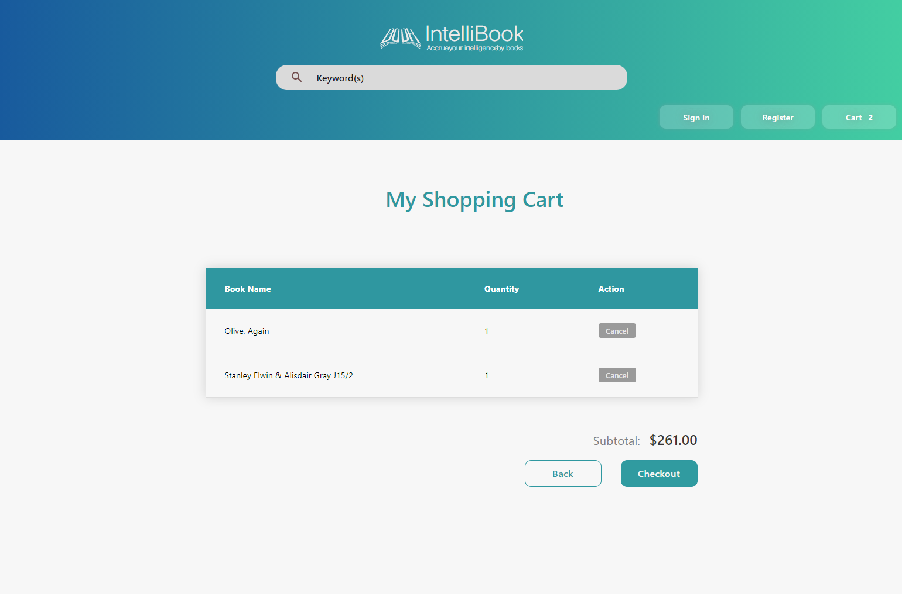
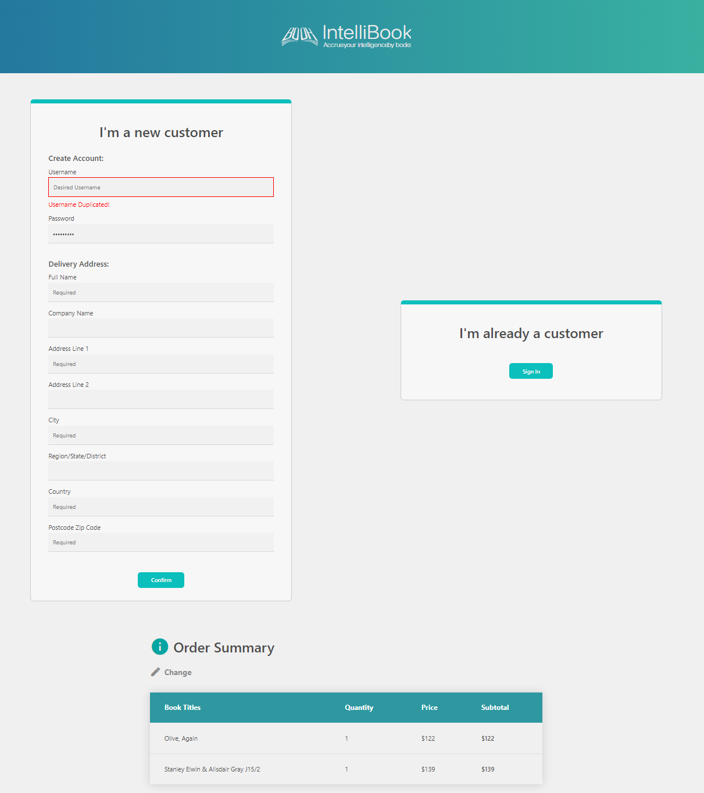
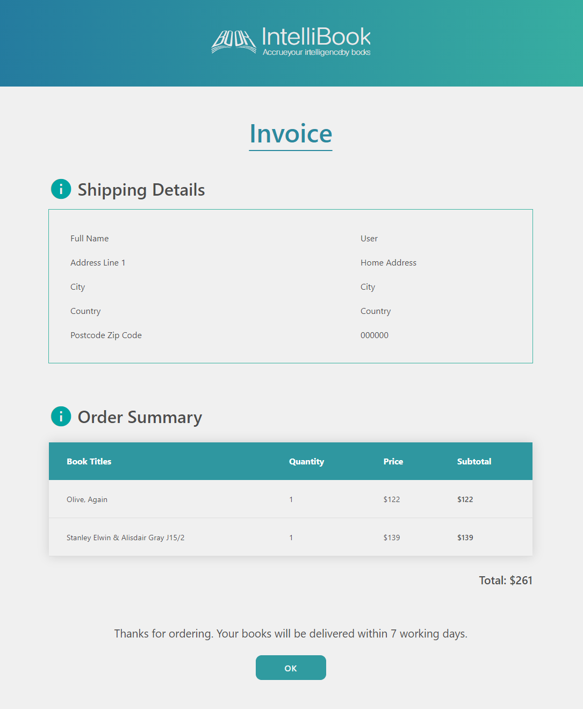
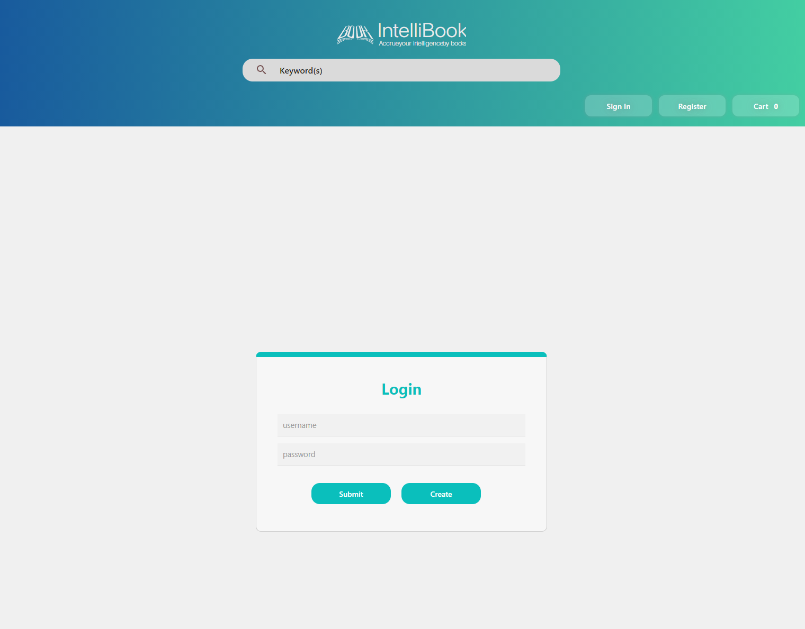

# IntelliBook

Built with HTML, CSS and PHP, this simple online bookstore implemented a variety of functions such as user login, create account, recording cart item per user account, updating database with new purchase order. 

## Application
- home page

- Cart page

- Checkout page

- Invoice page

- Login page

